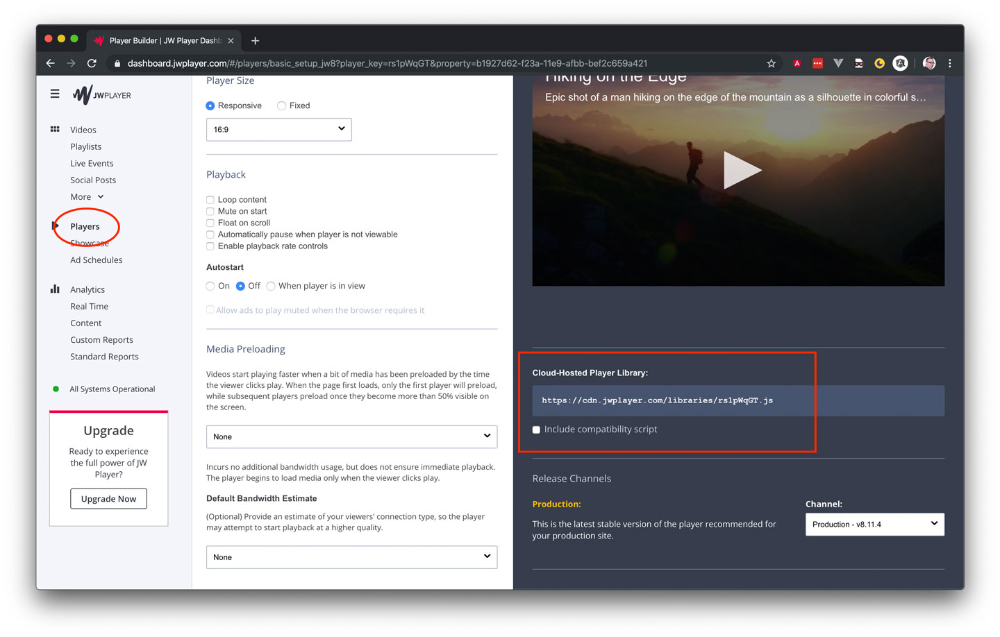

# ConfigurationManager

This property is used to configure the different player-classes.

At the moment there is only one player with a configurable value - die JWPlayer.

## properties

### jwplayer.player

The value helps you to define your "Cloud-Hosted Player Library".

#### example

``` javascript
const videoTag = document.qetElementById('player'),
      player = new GenericPlayer(videoTag);

player.config.jwplayer.player = 'https://cdn.jwplayer.com/libraries/rs1pWqGT.js';
```

#### Where can I find this value?

Follow this easy steps:

1. login to you JW-Player user-interface
2. click to "Player" in the navigation
3. choose the player you want to implement
4. copy the url to your "Cloud-Hosted Player Library"



